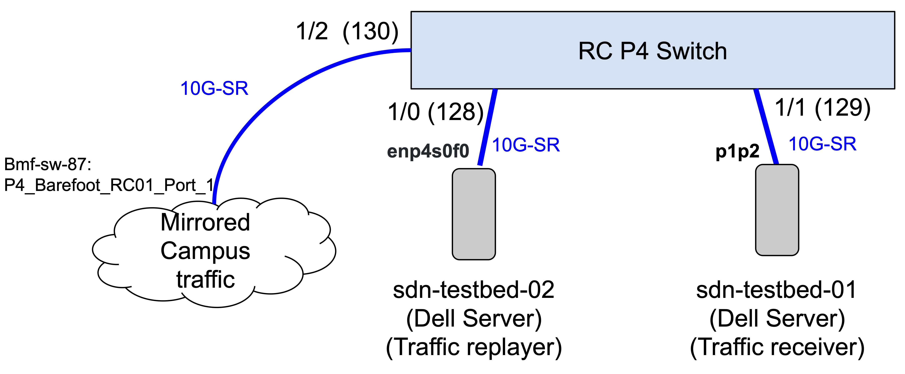

# Running The Experiment

1. On Tofino, compile and run the program. Then enable switchports.
    1. `bash p4_build.sh ~/Work/CtrlApp/examples/testcases/p4_programs/sf_ip_campus.p4`
    2. `./run_switchd.sh -p sf_ip_campus`
    3. `bfshell>ucli`
    4. `bf-sde> pm port-add 1/- 10G NONE`
    5. `bf-sde> pm port-enb 1/0`
    6. `bf-sde> pm port-enb 1/1`
2. On traffic receiver machine, start capturing traffic
    1. `sudo tcpdump_pfring -i p1p2 -nnnne -w tofino_output.pcap`
4. On traffic replayer machine, replay packet traces.
    1. (Option 1) Assuming you have a single pcap file.   
        1. `sudo tcpreplay -i enp4s0f0 ~/pcaps/capture_08_19_2020_T1400-1410.pcap`
    3. (Option 2) Assuming a series of packet traces are in directory: `~/pcaps/catql_campus_traffic/`.
        1. Edit `run_tcpreplay_dir_seq.sh` accordingly. 
        2. `bash run_tcpreplay_dir_seq.sh ~/pcaps/catql_campus_traffic enp4s0f0 `
6. Once the replay is done, on traffic receiver machine, stop tcpdump. Copy to CS project space.
7. Chop up pcaps into small chunks. For faster processing later.
    1. `tcpdump -r ~/pcaps/tofino_output.pcap -C 1000MB -w ./sliced/campus_10min_sliced.pcap`
8. On a powerful machine, run the following against chopped traces. Maybe put in one shell script and run it sequentially. `run_trial.sh` is one variation. 
    1. `python3 create_name_list.py ./sliced > names.list`
    2. `bash get_header_fields.sh` (this takes a long time) 
    3. `mv ./sliced/*.csv ~/mnt/anonflow/catql/eval/sf/trial/received_csvs/`
9. Let Molly know. Molly runs her analysis scripts on these CSV files.
